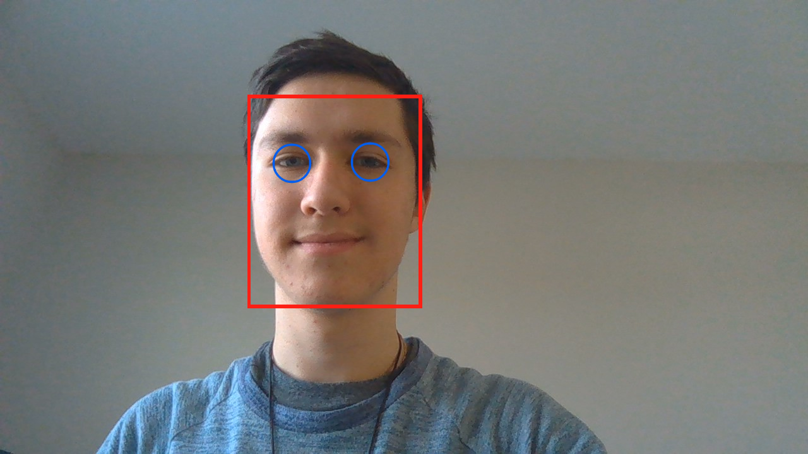

# Face-and-Eyes-Detection

Using OpenCV, I created a reusable face and eyes detector that displays a box around the face and circles around the eyes to be used in Computer Vision applications.

## Features:

* Detects and Displays the face with a rectangle and eyes with circles on a GUI
* Documented and easy to understand 
* Clear Organization and reputability

